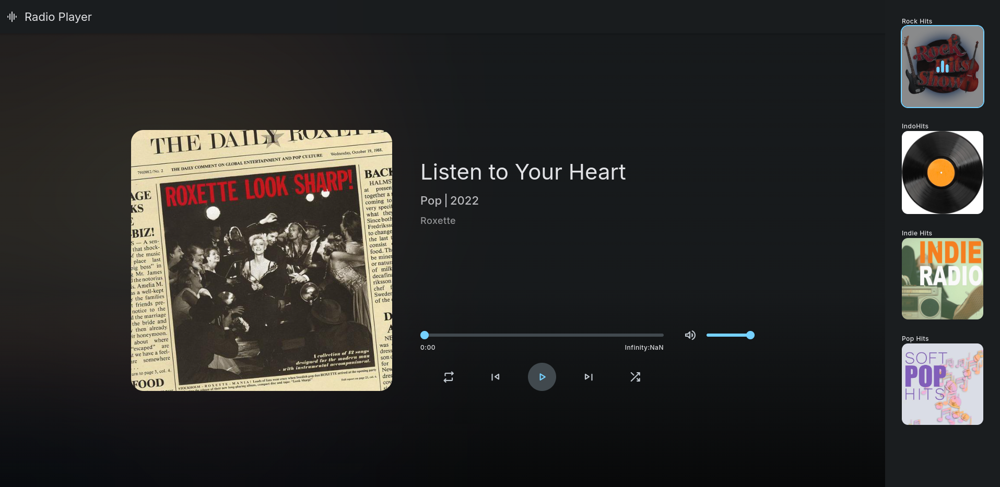

<div align="center">
  
  
  
  

  <br />
  <br />

  <h2 align="center">Web Radio Player</h2>

  A fully responsive web radio player using vanilla javascript, <br />Responsive for all devices, build using html, css, and javascript.

  <!-- <a href="https://PeWe79.github.io/azuracast-radio-player/"><strong>➥ Live Demo</strong></a> -->

</div>

<br />

### Demo Screeshots



### Prerequisites

Before you begin, ensure you have met the following requirements:

* [Git](https://git-scm.com/downloads "Download Git") must be installed on your operating system.

### Run Locally

To run **Radio Player** locally, run this command on your git bash:

Linux and macOS:

```bash
git clone https://github.com/PeWe79/azuracast-radio-player.git
```

Windows:

```bash
git clone https://github.com/PeWe79/azuracast-radio-player.git
```

### Contact

If you want to contact with me you can reach me at [Github](https://www.github,.com.com/PeWe79).

### License

This project is **free to use** and does not contains any license.
